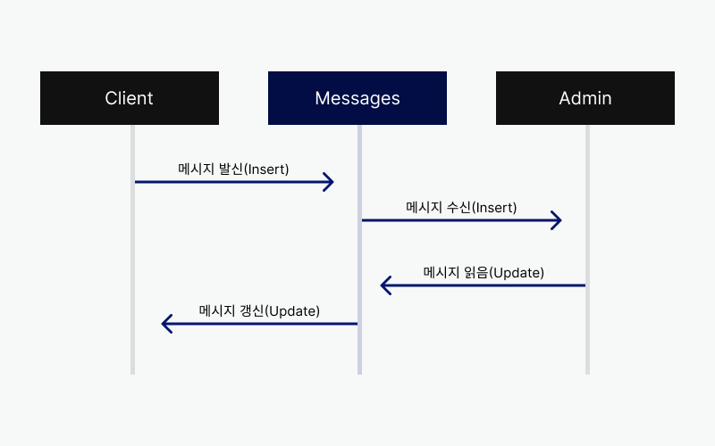
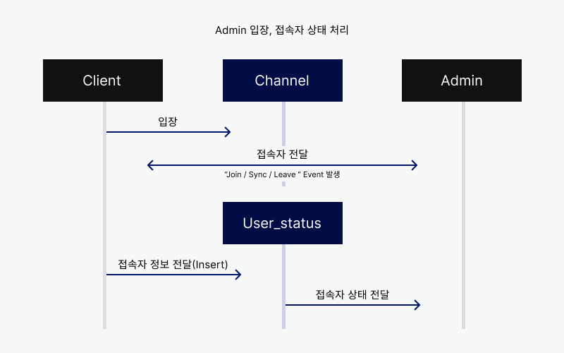
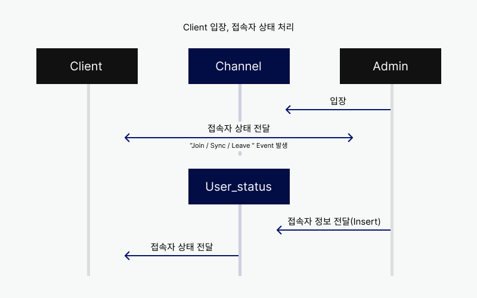
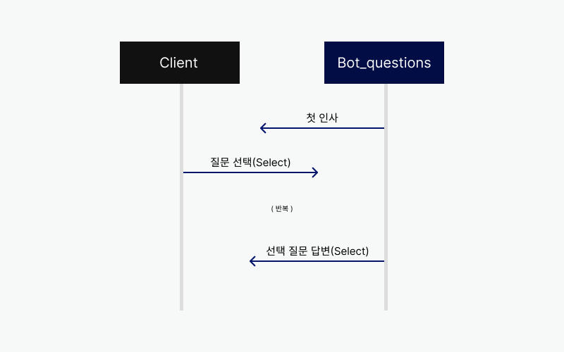
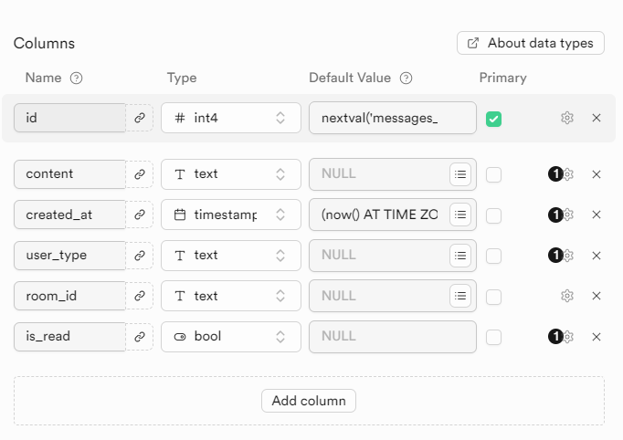
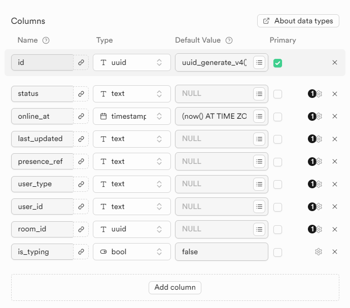
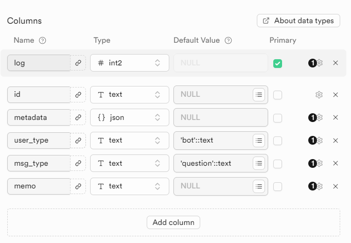

# 챗봇 채팅 개발 문서
## 목차
### 1. **이해하기**
  1. **기능 소개**  
     - 메시지
     - 접속 인원
     - 접속 목록
     - 챗봇
  
  2. **기능 작동 예시**  
     - 메시지  
     - 접속 인원 & 접속 목록
     - 챗봇 

  3. **JavaScript 활용 예시**  
     - 메시지 
     - 접속 인원 
     - 접속 목록 
     - 챗봇 

### 2. **활용하기**   
   1. Supabase 
      - Database      
      - Realtime      
   2. React 
      - 초기설정     
   3. 메시지     
   4. 접속 인원  
   5. 접속 목록  
   6. 챗봇  

### 3. **보완하기** 
   1. 에러 처리
   2. 보안 고려 사항
   <!-- - **테스트 및 디버깅 가이드**: 기능별 테스트 및 디버깅 방법 -->


## 1. 이해하기
이 섹션은 챗봇의 주요 기능과 작동 방식에 대해 설명합니다.

### 1.1 기능소개
---
### 메시지
챗봇 채팅은 관리자와 방문자가 1대1로 연락할 수 있는 기능을 제공합니다. 관리자가 온라인일 때 방문자가 관리자에게 직접 연락할 수 있도록 만들어졌습니다.   

챗봇 메시지는 Supabase Realtime을 활용하여 실시간 연락이 가능합니다. 메시지로 보낸 메시지는 Supabase messages table 속성에 맞춰 하나의 행으로 삽입됩니다. 각 행은 room_id를 포함하고 있어, 주고받는 메시지를 구분할 수 있습니다. 

messages table은 특정 조건에 맞춰 행을 삽입/갱신하며, 메시지 상태를 실시간으로 관리할 수 있습니다.



> *Supabase는 이벤트를 구독하는 기능이 있어, 같은 channel을 구독하고 있다면 이벤트 동작을 공유할 수 있습니다.*

### 접속 인원
챗봇 채팅은 현재 접속한 인원을 관리하는 기능을 제공합니다. 관리자와 사용자의 온라인 여부를 확인하기 위해 만들어졌습니다. 

챗봇 접속 인원은 Supabase Realtime을 활용하여 접속 인원을 실시간으로 관리합니다. 접속 인원 상태 추적은 join, sync, leave로 구성되며 Supabase 자체적으로 처리됩니다.    

접속자는 user_status table의 속성에 맞춰 하나의 행으로 삽입됩니다. 접속자 상태는 join, sync, leave 이벤트에 맞춰 갱신되며, 접속자 목록이 동기화(sync) 될 때 room_id를 기준으로 행 중복 삽입이 제한됩니다.  

- **관리자, 접속자 상태 처리**

  

- **사용자, 접속자 상태처리**

  

### 접속 목록
챗봇 채팅은 관리자에게 접속 목록 기능을 제공합니다. 다수의 이용자와 1:1 연락을 위해 만들어졌습니다. 해당 기능은 `admin`만 사용할 수 있습니다.

접속 목록은 접속 인원 기능을 활용하여 관리자를 제외한 현재 접속자를 보여줍니다. 접속 목록 기능은 접속 인원 기능과 연계됩니다.  

### 챗봇
챗봇 채팅은 방문자의 응답에 따라 반응하는 챗봇 기능을 제공합니다. 관리자가 오프라인일 때 방문자의 의문을 해소할 수 있도록 만들어졌습니다. 해당 기능은 `client`만 사용할 수 있습니다.

챗봇은 Supabase Database를 활용하여 bot_questions table에서 등록된 응답을 불러옵니다. 

응답은 bot_questions table 속성에 맞춰 삽입되어 있으며, 상위 질문과 하위 답변으로 구성되어 있습니다. 각 응답 id는 문자열 구조로 구성되어 있으며, 하위 답변 id는 상위 질문 id가 하이픈으로 연결되어 있습니다.



### 1.2. 기능 작동 예시
---
<h3>메시지</h3>
<p>
  <b>방문자와 관리자가 메시지를 주고 받는 상황</b>
</p>


<h3>접속 인원 & 접속 목록</h3>
<p>
  <b>관리자와 방문자의 접속 상태 추적이 이루어는 상황</b>
</p>


<h3>챗봇</h3>
<p>
  <b>방문자가 챗봇을 사용하는 상황</b>
</p>


### 1.3. JavaScript 활용 예시
---

| 개발 플랫폼 | 기능 | 참고 |
|:---:|:---:|:---:|
| Supabase | Database | [ 예제 ](#21-supabase-database) 
| - | Realtime | [ 예제 ](#22-supabase-realtime) 
| React | 초기 설정 | [ 예제 ](#23-react-초기-설정) 
| Javascript | 메시지 | [ 예제 ](#24-메시지) 
| - | 접속 인원 | [ 예제 ](#25-접속-인원)  
| - | 접속 목록 | [ 예제 ](#26-접속-목록) 
| - | 챗봇 | [ 예제 ](#27-챗봇)  

## 2. 활용하기
이 섹션은 JavaScript를 사용한 챗봇 채팅 기능 구현 방법을 안내합니다.

챗봇 채팅은 `Supabase Database`와 `Supabase Realtime`을 기반으로 작동합니다. 기능을 구현을 위해 `Supabase`에서 새로운 프로젝트 생성을 권장드립니다.

### 2.1. Supabase Database
---
이번 차례는 `Supabase Database` 생성을 안내합니다.

챗봇 채팅은 `messages`, `user_status`, `bot_questions` 총 3개의 **TABLE**에서 데이터를 요청합니다. 

**TABLE 생성 방법**
  1. `Supabase Dashboard`에서 **new project** 클릭하여 새로운 **PROJECT** 생성

  2. 새로운 프로젝트 내에서 **Table Editor** 또는 **SQL editor** 선택 
     - **Table Editor** : 직접 속성을 작성하여 새로운 **TABLE** 생성
     
     - **SQL editor** : SQL 코드를 작성하여 새로운 **TABLE** 생성
 
      **Messages TABLE**
      1. Table Editor > new table

          

      2. SQL Editor

          ```sql
          CREATE TABLE messages (
            id int4 PRIMARY KEY DEFAULT nextval('messages_id_seq'::regclass),
            content text,
            created_at timestamp DEFAULT (now() AT TIME ZONE 'KST'::text),
            user_type text,
            room_id text,
            is_read bool
          );
          ```

      **User_status TABLE**

        1. Table Editor > new table

            

        2. SQL Editor
            ```sql
            CREATE TABLE user_status (
              id uuid PRIMARY KEY DEFAULT uuid_generate_v4(),
              status text,
              online_at timestamp DEFAULT (now() AT TIME ZONE 'KST'::text),
              last_updated text,
              presence_ref text,
              user_type text,
              user_id text,
              room_id uuid,
              is_typing bool DEFAULT false
            );
            ```

      **Bot_questions TABLE**

     1. Table Editor > new table

        

     2. SQL Editor
        ```sql
        CREATE TABLE bot_questions (
          log int2 PRIMARY KEY,
          id text,
          metadata json,
          user_type text DEFAULT 'bot'::text,
          msg_type text DEFAULT 'question'::text,
          memo text
        );
        ```

### 2.2. Supabase Realtime
---
이번 차례는 `Supabase Realtime` 설정을 안내합니다.

`Supabase`는 실시간 데이터 전달을 위한 **Realtime**을 지원합니다. **Realtime**은 기본적으로 활성화 되어 있지 않습니다. 새로 생성한 **TABLE**에서 **Realtime**을 설정해야 합니다.

챗봇 채팅은 `messages`, `user_status` 두 개의 **TABLE Realtime**이 활성화 되어 있습니다.

**TABLE Realtime 설정 방법**
  1. `Supabase Dashboard`에서 생성한 **PROJECT** 클릭

  2. 프로젝트 내에서 **Table Editor** 클릭 

  3. 우측 **Realtime Off** 클릭   
    *Realtime On으로 되어 있다면 Realtime 활성화 된 상태입니다.*

  4. **Enable realtime** 선택

      [Supabase Reatime Docs 참고](https://supabase.com/docs/guides/realtime?queryGroups=language&language=js)

### 2.3. React 초기 설정
---
이번 차례는 `supabase` **React 초기 설정**을 안내합니다.

1. **Supabase JS 초기 설정**   

    먼저 `Supabase API`를 사용하기 위해 `@supabase/supabase-js` 패키지를 설치합니다. 

    ```javascript
    // 1. npm install @supabase/supabase-js
    ```

    설치한 패키지로부터 **createClient**를 불러와, 프로젝트 연결을 설정합니다.
    ```javascript
    // 2. Initialize the JS client
    import { createClient } from '@supabase/supabase-js'
    const supabase = createClient(SUPABASE_URL, SUPABASE_ANON_KEY)
    ```
    > SUPABASE_URL, SUPABASE_ANON_KEY는 생성한 프로젝트 환경설정에서 확인할 수 있습니다.

2. **React component 초기 설정**   

    현재 프로젝트와 연결된 **supabase** 변수를 불러옵니다.    
    `App` 컴포넌트가 처음으로 마운트될 때 **연결할 테이블** 과 **사용을 원하는 이벤트**가 구독되도록 설정합니다.   

    아래 예시는 **'messages table'** 과 **'postgres_changes'** 이벤트가 구독된 상태입니다.

    > postgres_changes, event 객체는 `DML` 명령어를 문자열로 할당 받습니다.

    ```javascript
    import supabase from './supabase.js'

    function App() {
      useEffect(function supabaseInitialize() {
        // messages table, 'INSERT' 이벤트 구독
        supabase
          .channel('messages')
          .on('postgres_changes', { event: 'INSERT', schema: 'public', table: 'messages' }, (payload) => {})
          .subscribe()

      }, [])
    }
    ```
    > **.on()** 이벤트 추가 함수, **.subscribe()** 구독 함수    

    `INSERT` 동작이 발생할 때마다 **messages table**로 데이터가 삽입됩니다.   

    삽입된 데이터는 **.on** 함수의 세 번째 인자에서 확인할 수 있습니다.   
    **.on** 함수는 **supabase** 변수에 이벤트를 추가적으로 체이닝 할 수 있습니다.   

    **.subscribe()** 함수는 이전 함수들이 동작하도록 이벤트 핸들러 역할을 합니다. 


### 2.4. 메시지
---
이번 차례는 **메시지** 기능 구현을 설명합니다.    

메시지는 `발신` `수신` `상태` 기능으로 구성되어 있습니다.    
**특정 함수**가 실행될 때 아래 `초기설정`에서 구독한 해당 이벤트가 동작합니다.     
*`INSERT` 이벤트가 실행되면 **payload**가 출력됩니다.*

**초기설정**
```javascript
import supabase from './supabase.js'

function App() {
  useEffect(function supabaseInitialize() {
    // messages table, 'INSERT' 'UPDATE' 이벤트 구독
    supabase
      .channel('messages')
      .on(
        'postgres_changes', 
        { event: 'INSERT', schema: 'public', table: 'messages' }, 
        (payload) => {
          console.log('INSERT', payload)
        }
      )
      .on(
        'postgres_changes', 
        { event: 'UPDATE', schema: 'public', table: 'messages' }, 
        (payload) => {
          console.log('UPDATE', payload)
        }
      )
      .subscribe()
      
  }, [])
}
```

### 2.4.1. 메시지 발신
이번 차례는 특정 함수, 메시지 `발신`을 설명합니다.

  1. **요청**

      ```javascript
      const sendMessage = async () => {
        const { data , error } = await supabase
          .from('messages')
          .insert([{ content: newMessage, user_type: who, room_id: roomId, is_read: false }])
          .select()
        if (error) return console.error('SendMessage Error', error);
      };
      ```
      - **from** 함수는 이벤트를 동작할 테이블을 설정합니다.    

      - **insert** 함수는 설정한 값을 테이블에 삽입합니다.    
        - `newMessage` : 메시지 내용   

        - `who` : 발신인, 'client' 또는 'admin'    

        - `room_id` : 발신인 고유 ID, 채팅방 역할   

        - `is_read` : 상대 읽음 여부   

      - **select** 함수는 값을 반환합니다.

  2. **응답**   
    **messages table**, 새로운 행으로 **insert() 인자**가 삽입됩니다.
      ```javascript
      data null
      error null
      ```

  3. **활용**   
    특정 상황에 함수를 실행해야 이벤트가 동작합니다.    
    해당 함수는 초기 마운트 하여 사용할 수 없습니다.

### 2.4.2. 메시지 수신
이번 차례는 메시지 `수신`을 설명합니다.   

메시지 `발신` 함수가 실행되면 **supabaseInitialize** 함수에서 구독한 `INSERT` 이벤트가 동작합니다.    

`발신`을 실행 하더라도 `INSERT` 이벤트가 구독되어 있다면 메시지 `수신`이 동작합니다.    
구독한 `INSERT` 이벤트에서 **payload**를 반환합니다.

  1. **요청**   

      `INSERT` 이벤트가 작동하면 마운트 되어 있는 해당 **.on** 함수가 동작합니다.

  2. **응답**   
      ```javascript
      // console.log('INSERT', payload)
      {
        commit_timestamp: "2024-09-30T08:13:31.590Z",
        errors: null,
        eventType: "INSERT",
        new: {
          content: "안녕하세요",
          created_at: "2024-09-30T17:13:31.585542+00:00",
          id: 1,
          is_read: false,
          room_id: "84de1fbd-9220-40ab-baa1-04267b096184",
          user_type: "client"
        }, 
        old: {},
        schema: "public",
        table: "messages"
      }
      // client가 작성한 "안녕하세요"가 읽지 않은 상태로 24.9.30. 17시 13분 부로 messages TABLE의 행으로 삽입됨 
      ```

  3. **활용**   
      **new** 객체 값으로 메시지 데이터를 활용 할 수 있습니다.   

      **new** 객체를 제외한 **payload** 객체는 `Supabase`에서 자체적으로 생성된 값입니다.   

### 2.4.3. 메시지 갱신
이번 차례는 특정 `갱신` 함수, 메시지 `갱신`을 설명합니다.  

특정 `갱신` 함수가 실행되면 **supabaseInitialize** 함수에서 구독한 `UPDATE` 이벤트가 동작합니다.    

특정 `갱신` 함수를 실행 하더라도 `UPDATE` 이벤트가 구독되어 있다면 메시지 `갱신`이 동작합니다.    
구독한 `UPDATE` 이벤트에서 **payload**를 반환합니다.    

  1. **요청**   
      ```javascript
      const updateMessage = async () => {
        const { data, error } = await supabase
          .from('messages')
          .update({ is_read: true })
          .match({ room_id: roomId, user_type: 'who의 상대방', is_read: false })
          .order('id', { ascending: false })
          .select();
        if (error) return console.error('UpdateMessage Error', error);
      };
      ```
      - **from** 함수는 이벤트를 동작할 테이블을 설정합니다.    

      - **update** 함수는 변경할 속성값을 설정합니다.    

      - **match** 함수는 속성값을 변경할 행을 찾습니다.    
        - `room_id` : 발신인 고유 ID, 채팅방 역할   

        - `user_type` : **who** 상대방, 'client'이면 'admin' 또는 'admin'이면 'client'    

        - `is_read` : 상대 읽음 여부   

      - **order** 함수는 첫번째 인자를 기준으로 행을 정렬합니다. 두번째 인자는 오름차순을 설정합니다.

      - **select** 함수는 값을 반환합니다.

  2. **응답**   
      ```javascript
      // console.log('UPDATE', payload)
      {
        schema: "public",
        table: "messages",
        commit_timestamp: "2024-09-30T09:02:01.285Z",
        eventType: "UPDATE",
        new: {
          id: 1,
          content: "안녕하세요",
          is_read: true,
          user_type: "client"
          created_at: "2024-09-30T18:01:42.139884+00:00",
          room_id: "84de1fbd-9220-40ab-baa1-04267b096184",
        },
        old: {
          id: 1
        },
        errors: null
      }
      // client가 작성한 메시지 id가 1인 메시지는 24.9.30. 18시 01분 부로 읽지 않음에서 읽음으로 갱신됨
      ```

  3. **활용**   

      해당 함수는 읽음 처리를 하도록 동작하고 있습니다.   
      특정 상황에 함수를 실행해야 이벤트가 동작합니다.    
      해당 함수는 초기 마운트 하여 사용할 수 없습니다.

      **update** 함수는 **match** 함수가 충족하는 행만 갱신합니다.   
      **update** 함수로 다른 속성을 갱신/수정 할 수 있습니다.   

      **payload** 의 **old** 객체는 **new**(갱신한 데이터) 객체의 이전 상태를 보여줍니다.   

### 2.5. 접속 인원
이번 차례는 `접속 인원` 상태 추적을 설명합니다.   

접속 인원은 `Supabase Presence`를 사용합니다.    
`Supabase Presence`는 `sync` `join` `leave` 이벤트로 구성되어 있습니다.    

해당 이벤트가 실행될 때 아래 `초기설정`에서 작성한 함수가 동작합니다.     


**초기설정**    

`App` 컴포넌트가 처음으로 마운트될 때 **supabase**의 **channel**을 설정합니다.   
```javascript
// Realtime 'presence'
useEffect(function supabaseInitialize() {
  ...
  const roomOne = supabase.channel('room-one');
}, [])
```
**'client'**, **'admin'** 은 동일한 **channel**을 가지고 있어야 합니다.    
**channel** 함수 인자는 임의 문자열로 할당할 수 있습니다. 

  1. **요청**   
      ```javascript
      roomOne
        .on('presence', { event: 'sync' }, () => {
          const newState = roomOne.presenceState();
          console.log('sync', newState);
        })
        .on('presence', { event: 'join' }, ({ key, newPresences }) => {
          console.log('join', newPresences);
        })
        .on('presence', { event: 'leave' }, ({ key, leftPresences }) => {
          console.log('leave', leftPresences);
        })
        .subscribe(async (status) => {
          if (status !== 'SUBSCRIBED') return;
          await roomOne.track(userStatus);
        });
      ```
      - **{ event: 'sync' }** : 'room-one' 채널에 접속한 인원 정보 목록을 가져옵니다.    
        *sync는 join, leave와 함께 동작합니다.*

      - **{ event: 'join' }** : 'room-one' 채널에 접속한 인원 정보를 가져옵니다.    

      - **{ event: 'leave' }** : 'room-one' 채널에서 나간 인원 정보를 가져옵니다.    

      - **track** 함수는 사용자를 추적하도록 설정합니다. 인자는 사용자의 정보를 가지고 있습니다.    
        *admin, client 둘 다 track을 설정하지 않으면 추적되지 않습니다.*

      **userStatus** 변수 
      ```javascript
      // admin
      const userStatus = {
        user: 'user-1',
        online_at: new Date().toISOString(),
        user_type: who, // 'admin'
        room_id: room_id,
      };

      // client
      const userStatus = {
        user: 'user-2',
        online_at: new Date().toISOString(),
        user_type: who, // 'client'
        room_id: room_id,
      };
      ```
      `Supabase Presence`는 **userStatus** 변수를 기반으로 인원 정보를 반환합니다.

  2. **응답**   
      - **{ event: 'sync' }**      

        ```javascript
        [
          {
            online_at: "2024-09-30T09:31:00.0000",
            room_id: "84de1fbd-9220-40ab-baa1-04267b096184",
            user: "user-2",
            user_type: "client",
            presence_ref: "F_n7-vOSqXUmmEpE"
          },
          ...
        ]
        ```
      - **{ event: 'join' }**    

        ```javascript
        [
          {
            online_at: "2024-09-30T09:31:00.0000",
            room_id: "84de1fbd-9220-40ab-baa1-04267b096184",
            user: "user-2",
            user_type: "client",
            presence_ref: "F_n7-vOSqXUmmEpE"
          }
        ]
        ```
     - **{ event: 'leave' }**   

        ```javascript
        [
          {
            online_at: "2024-09-30T09:35:00.0000",
            room_id: "84de1fbd-9220-40ab-baa1-04267b096184",
            user: "user-2",
            user_type: "client",
            presence_ref: "F_n7-vOSqXUmmEpE"
          }
        ]
        ```
        
  3. **활용**   
        **presence_ref** 객체값은 사용자가 **track** 되었을 때 `Supabase`에서 부여하는 임의 식별값 입니다.    

        여러 명이 동시에 접속하거나 접속해제 했을 때, **{ event: 'join' }**, **{ event: 'leave' }** 이벤트는 인원 수에 맞춰 동작합니다.   
        **{ event: 'join' }**, **{ event: 'leave' }** 이벤트는 접속인원, 접속해제 인원과 `1:1` 대응으로 실행됩니다.

### 2.6. 접속 목록
이번 차례는 `접속 목록` 기능을 설명합니다.    
해당 기능은 **'admin'** 만 사용할 수 있습니다.

`React` 상태 처리 변수와 `접속 인원` 기능을 활용합니다.   

접속자 정보는 특정 상황에 갱신되도록 `Supabase Presence`와 **user_status table**의 `UPDATE` 이벤트를 구독합니다.

  1. **요청**   
      ```javascript
      // 'user_status' table, 'UPDATE' 이벤트 구독
      supabase
        .channel('user_status')
        .on(
          'postgres_changes', 
          { event: 'UPDATE', schema: 'public', table: 'user_status' }, 
          (payload) => {
            setUserList((prev) => overwriteData(prev, [payload.new], 'user_status'));
          }
        )
        .subscribe();
      ```
      - **overwriteData** 함수는 **userList** 에서 일치하는 인원에게 갱신 정보를 덮어 씌웁니다.

      ```javascript
      // 접속 인원 기능 활용
      roomOne
        .on('presence', { event: 'sync' }, () => {
          // 접속 인원 목록, userList 업데이트
          const newState = roomOne.presenceState();
          Object.keys(newState).forEach((person) => {
            updateLeaveUser('online', newState[person][0].room_id, setUserList);
          });
        })
        .on('presence', { event: 'join' }, ({ key, newPresences }) => {
          // 입장 인원, userList 업데이트
          const sendVisitUser = async () => {
            ...
            setUserList((prev) => preventDuplicatedUser(prev, newPresences));
          }
          sendVisitUser();
        })
        .on('presence', { event: 'leave' }, ({ key, leftPresences }) => {
          // 나간 인원, userList 업데이트
          updateLeaveUser('offline', key, setUserList);
        })
        ...
      ```
      - **{ event: 'sync' }** : 'room-one' 채널에 접속되어 있는 **userList** 인원을 'online'으로 유지합니다.    

      - **{ event: 'join' }** : 'room-one' 채널에 접속한 인원 정보를 **userList** 변수에 추가합니다.    
      *배열 요소가 중복되지 않도록 preventDuplicatedUser 함수에서 중복을 걸러냅니다.*

      - **{ event: 'leave' }** : 'room-one' 채널에서 나간 **userList** 인원을 'offline'으로 설정합니다.    

  2. **응답**   
      - **{ event: 'join' }, { event: 'sync' }**      

        ```javascript
        [
          [
            {
              room_id: "84de1fbd-9220-40ab-baa1-04267b096184",
              presence_ref: "F_n7-vOSqXUmmEpE"
              online_at: "2024-09-30T09:31:17.882Z",
              user: "user-2",
              user_type: "client",
            }
          ]
        ]
        ```
      - **{ event: 'leave' }, { event: 'sync' }**    

        ```javascript
        [
          [
            {
              id: "9336069d-d95c-4c03-9ae7-50e4797dbcbb",
              user_id: "b2d0ea1a-7f11-11ef-b530-0a58a9feac02",
              room_id: "84de1fbd-9220-40ab-baa1-04267b096184",
              presence_ref: "F_n7-vOSqXUmmEpE",
              online_at: "2024-09-30T09:31:17.882Z",
              last_updated: "1727692230644",
              status: "offline",
              user_type: "client",
              is_typing: false
            }
          ]
        ]
        ```
     - **'user_status' table, 'UPDATE' 이벤트**   

        ```javascript
        [
          [
            {
              id: "ac2ecbef-0ff3-4855-a746-bd725e471b7f",
              user_id: "92175d94-7f17-11ef-9957-0a58a9feac02",
              room_id: "84de1fbd-9220-40ab-baa1-04267b096184",
              presence_ref: "F_n7-vOSqXUmmEpE",
              online_at: "2024-09-30T09:31:17.882Z",
              last_updated: "1727692494856",
              status: "online",
              user_type: "client"
              is_typing: true,
            }
          ]
        ]
        ```

  3. **활용**   

      `Supabase Presence` 이벤트에서 **sendVisitUser**, **updateLeaveUser** 함수는 접속자를 'online' 'offline'으로 갱신합니다.    
      *{ event: 'sync' } 이벤트는 접속자의 목록을 key-value 배열 형태를 가지고 있습니다.*

      **user_status table** 의 `UPDATE` 이벤트는 접속자의 타이핑 여부를 갱신합니다.

      **sendVisitUser** 함수는 접속자 중복을 판별하고 **user_status table** 새로운 행으로 삽입합니다.    
      **user_status table** 의 `UPDATE` 이벤트가 발생하면 **userList** 인원 정보가 덮어 씌어집니다.    
      이때 **{ event: 'join' }** 과 **{ event: 'leave' }** 응답값의 차이가 발생합니다.    

      > { event: 'sync' } 이벤트는 'join' 'leave' 이벤트와 함께 동작합니다.

### 2.7. 챗봇
이번 차례는 `챗봇` 기능을 설명합니다.   
해당 기능은 **'client'** 만 사용할 수 있습니다.

챗봇은 `Supabase Database` 를 사용합니다.    
`Table Realtime`을 설정하지 않아도 됩니다.    

아래 `초기설정`에서 작성한 함수는 특정 함수 이벤트가 실행되도록 허용합니다.     

**초기설정**    

`App` 컴포넌트가 처음으로 마운트될 때 **bot_questions table - postgres_changes** 이벤트가 구독되도록 설정합니다.   
```javascript
useEffect(function supabaseInitialize() {
  ...
  // 'bot_questions' table, 이벤트 설정
  supabase
    .channel('bot_questions')
    .on('postgres_changes', { event: 'SELECT', schema: 'public', table: 'bot_questions' }, (payload) => {})
    .subscribe();

  // 챗봇 함수, 기본값으로 실행 
  botTable()
}, [])
```

  1. **요청**   
      - **챗봇**     

        ```javascript
        const botTable = async (id = 0, table = 'bot_questions') => {
          const { data, error } = await supabase.from(table).select().eq('id', id);
          if (error) return console.error('botQuestions Error', error);
          setMessages((prev) => {
            if (prev) return [...prev, data];
            else return [data];
          });
        };
        ```
        - **botTable** 함수는 **id** 를 0, **table** 을 'bot_questions'으로 인자 기본값을 가지고 있습니다.     
  
        - **from** 함수는 이벤트를 동작할 테이블을 설정합니다.    
  
        - **select** 함수는 해당 테이블에서 모든 행을 선택, 반환합니다.
         
        - **eq** 함수는 동일 조건을 설정합니다. 첫번째 인자는 테이블의 속성, 두번째 인자는 속성의 값입니다.    
  
        - **setMessages** 함수는 조건문에 맞춰 반환값을 생성하거나 추가합니다.    

      - **client 질문 선택**   

        ```javascript
        const onClickLink = (q) => {
          return () => {
            // 선택 질문 메시지 배열에 추가
            sendMessage(q.q_title);
            // 요청 전달
            setTimeout(() => {
              botTable(q.id);
            }, 0);
          };
        };
        ```
        - **onClickLink** 함수는 중첩 함수로 클릭 이벤트 핸들러에서 **q** 인자를 사용할 수 있도록 합니다.      

        - **sendMessage** 함수는 **client** 가 선택한 답변의 내용을 비동기로 전달합니다.    

        - **botTable** 함수는 **id**와 일치하는 챗봇의 응답을 불러옵니다.

        - **setTimeout** 함수는 동기 처리하는 것처럼 보이도록 **botTable** 함수 실행 순서를 늦춥니다.     

  2. **응답**   
      - **client 초기 접속**      

        ```javascript
        [
          {
            id: "0",
            metadata: {
              title: "안녕하세요.",
              subtitle: "무엇을 알려드릴까요?",
              links: [
                {
                  id: "1",
                  q_title: "인적사항"
                },
                {
                  id: "2",
                  q_title: "프로젝트"
                }
              ]
            },
            user_type: "bot",
            msg_type: "question",
            log: 1,
            memo: "첫 질문"
          }
        ]
        ```
      - **client 질문 선택**    

        ```javascript
        {
          id: "1",
          q_title: "인적사항"
        }
        ```
     - **bot 답변 반환**   

        ```javascript
        [
          {
            id: "1",
            metadata: {
              title: "안녕하세요",
              subtitle: "이것은 인적사항 질문입니다.",
              links: [
                {
                  q_title: "출생",
                  id: "1-1",
                  order: 0
                },
                {
                  q_title: "학력",
                  id: "1-2",
                  order: 1
                },
                {
                  q_title: "병역",
                  id: "1-3",
                  order: 2
                },
                {
                  q_title: "돌아가기",
                  id: "0",
                  order: 3
                }
              ]
            },
            user_type: "bot",
            msg_type: "question",
            log: 2,
            memo: "인적사항(상위 질문)"
          }
        ]
        ```
        
  3. **활용**   
        **supabaseInitialize** 함수가 처음 마운트 될 때, 챗봇은 첫 질문을 출력합니다.    

        **'client'** 는 **links** 배열로 생성된 컴포넌트를 클릭하여 **onClickLink** 함수를 실행합니다.    
        해당 **id** 와 일치하는 답변을 **bot_questions table** 에서 불러옵니다.   
        *q 는 `links.map()`으로 컴포넌트를 생성할 때 필요한 map 함수의 첫번째 인자를 할당 받습니다.*

        **bot_questions table** 속성에 맞춰 새로운 행을 추가하면 새로운 질문을 생성할 수 있습니다.   
        *metadata JSON 속성은 이전에 작성한 JSON 구조와 동일하게 작성해야 합니다.*

## 3. 보완하기
### 3.1. 에러 처리
---
이번 차례는 챗봇 채팅 에러 처리를 안내합니다.

**Supabase 접근 오류**
```
"invalid input syntax for type uuid: \"room_id\"" 
```
`Supabase table` 접근할 때 발생하는 오류입니다. 해당 오류는 **room_id** 속성을 선택 또는 삽입 이벤트를 수핼할 때 `uuid` 형태와 할당한 형태가 일치하지 않을 때 발생합니다. 

`uuid`는 128-bit의 숫자 문자열입니다. 총 길이는 36자리입니다. 32개의 16진수 숫자가 4개의 하이픈으로 연결된 8-4-4-4-12 형태입니다.    

`uuid`는 `uuid generator` 패키지를 활용하여 `uuid`를 생성할 수 있습니다. 현재 생성한 테이블의 `uuid` 기본값은 버전 4로 설정되어 있습니다. `uuid generator`를 `v4`로 불러와, `uuid` 값을 room_id로 사용할 수 있습니다.    
> user_status table uuid 기본값 참고

아래 순서를 거쳐 에러를 해결할 수 있습니다.  

1. `uuid generator` 패키지 설치

    ```javascript
    npm install uuid
    ```

2. `uuid` 불러오기
    ```javascript
    import { v4 as uuidv4 } from 'uuid';
    uuidv4(); // '9b1deb4d-3b7d-4bad-9bdd-2b0d7b3dcb6d'
    ```

*기본값이 설정되어 있는 속성은 해당 형태와 일치해야 합니다. 할당한 값 형태와 기본값 형태가 일치하도록  유의하시기 바랍니다.* 

**순환참조 오류**
```
Uncaught (in promise) TypeError: Converting circular structure to JSON
    	--> starting at object with constructor 'HTMLButtonElement'
```
`HTMLButtonElement`에서 발생하는 오류입니다. 주로 객체가 순환참조를 하고 있을 때 발생합니다. 순환참고는 객체가 자신을 참조하거나 두 개 이상의 객체가 서로를 참고합니다.    

해당 오류는 챗봇 기능에서 발생합니다. 순환참조를 방지하기 위해 `button onClick` 함수를 함수로 한번 더 감싸주어야 합니다.

```html
<!-- 오류 발생 -->
<div key={i} className="qusetion" onClick={botTable(q.id)}>
  {q.q_title}
</div>
```
```html
<!-- 정상 작동 -->
<div key={i} className="qusetion" onClick={() => botTable(q.id)}>
  {q.q_title}
</div>
```

**subscribe, 구독 오류**
```
Uncaught tried to subscribe multiple times. 'subscribe' can only be called a single time per channel instance
```
하나의 `Presence` 채널을 여러 번 구독했을 때 발생하는 오류입니다. `Supabase Presence`는 하나의 채널을 여러 번 구독할 수 없습니다. 

*다만 여러 채널을 설정하면 1대1 대응으로 구독할 수 있습니다.*

```javascript
// 오류 발생
const roomOne = supabase.channel('room-one');
roomOne.subscribe();
roomOne.subscribe();
```
```javascript
// 정상 작동
const roomOne = supabase.channel('room-one');
const roomTwo = supabase.channel('room-two');
roomOne.subscribe();
roomTwo.subscribe();
```

**객체 undefined 오류**
```
Uncaught TypeError: Cannot read properties of undefined (reading 'content')
```
불러오는 객체를 읽을 수 없을 때 발생하는 오류입니다. 주로 갱산한 정보를 덮어씌울 때 객체 형태 불일치로 발생합니다.    

데이터를 덮어씌우는 함수를 작성할 때 현재 데이터와 전달받은 데이터 형태가 서로 일치하도록 데이터 접근을 고려해야 합니다. 덮어씌워진 데이터는 배열 형태로 반환되어야 합니다. 

### 3.2. 보안 고려 사항
---
이번 차례는 챗봇 채팅 보안 고려 사항을 안내합니다.

**supabase key 환경변수 처리**    
**supabase** 변수는 `Supabase` 프로젝트를 사용할 수 있도록 연결합니다. **createClient** 함수 인자는 **supabase** 변수의 아이디와 비밀번호 역할을 합니다. 배포 시 아이디와 비밀번호가 탈취되면 악의적인 사용으로 정상적인 `Supabase` 사용이 어려울 수 있습니다.   

```javascript
// supabase.js
const supabase = createClient(SUPABASE_URL, SUPABASE_ANON_KEY)
```

이를 방지하기 위해 **SUPABASE_URL**, **SUPABASE_ANON_KEY** 두 개의 변수를 환경변수로 선언해야 합니다. `.env` 파일을 생성하고 `key=value` 형식으로 작성합니다. 작성한 환경변수는 프로젝트 내 어디서든 불러올 수 있습니다.   

- `.env` 작성방법   

    ```javascript
    // 기본
    SUPABASE_URL = "SUPABASE_URL"
    SUPABASE_ANON_KEY = "SUPABASE_ANON_KEY"
    
    // vite 프로젝트 사용 시
    VITE_SUPABASE_URL = "SUPABASE_URL"
    VITE_SUPABASE_ANON_KEY = "SUPABASE_ANON_KEY"
    ``` 

- `.env` 변수 호출방법    

    ```javascript
    // supabase.js
    const SUPABASE_URL = import.meta.env.VITE_SUPABASE_URL;
    const SUPABASE_ANON_KEY = import.meta.env.VITE_SUPABASE_ANON_KEY;
    const supabase = createClient(SUPABASE_URL, SUPABASE_ANON_KEY)
    ```
`.env` 변수 작성방법과 호출방법은 개발 환경에 따라 다를 수 있습니다.    